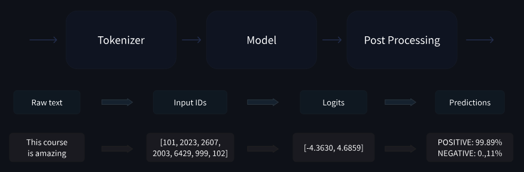
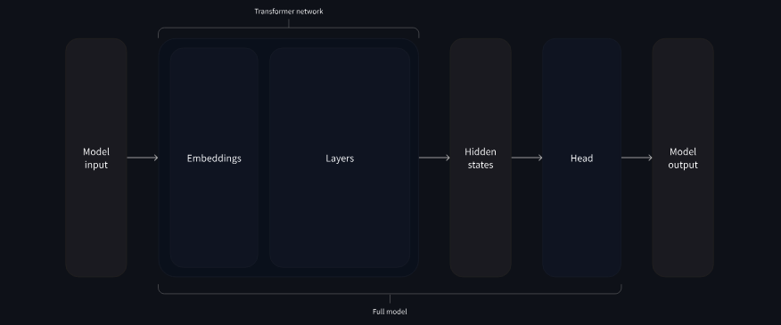

# Learning LLMs (HuggingFace NLP Course)

## Terms


## Transformers


There are a lot of papers that have a key impact of the field. Some of them are in my Mendeley library and will be covered here as well.

But, in general, all Transformer models can be categorised into three families of models:
- **GPT-like**: also called _auto-regressive_ Transf. models
- **BERT-like**: also called _auto-encoding_ Transf. models
- **BART/T5-like**: also called _sequence-to-sequence_ Transf. models

All models are trained in the self-superviased fasion: the objective is computed out of the input.
After that, there is a transfer learning - finetuning the model for a specific task.

### Auto-encoding Models 

The idea: take a text and make vector representation of the text. They trained by corrupting a given sentence, a random word in it, and asking the modfels with finding or reconstructing the initial sentence. The encoder (or auto-encoding) models use only the encoder of a Transformer model.

Usage example: sentence clasification, named entity recognition, extractive question answering (I give you a sentence and ask about the sentence. For example: Passage: "The Eiffel Tower was built in 1889 and is located in Paris, France." Question: "When was the Eiffel Tower built?")

Model Examples: ALBERT, BERT, DIstilBERT, ELECTRA, RoBERTa

### Auto-regressive Models

The idea: take the first words of the text (right shifted) and produce the next word (give a vector of probabilities for the next word). The pretraining here is to predict the next word in a sentence given previous words in the sentence. The decoder (or auto-regressive) models use only the decoder of a Transformer model.

Usage examples: text generation

Model Examples: CTRL, GPT, GPT-2, Transformer XL


### Sequence-to-Sequence Models


The idea: the encoder sees all the sentence, while decoder sees only the first part of the sentence. The pretraining is, for example, by replacing random spans of text (that can contain several words) with a single mask special word, and the objective is to predict those words. The encoder-decoder (or sequence-to-sequence) models use both parts of a Transformer model.

Usage examples: summarization, translation, generative question answering

Model Examples: BART, mBART, Marian, T5, mT5, Pegasus, ProphetNet, M2M100, MarianMT

Or it can be a combination of encoder + decoder models: BERT + GPT-2, BERT + BERT, RoBERTa + RoBERTa, etc.

In all of these models there will be always the intrinsic bias that will not dissappear.

### Example

Pipeline function:

```python
from transformers import pipeline

translator = pipeline("translation", model="Helsinki-NLP/opus-mt-fr-en")
translator("Ce cours est produit par Hugging Face.")
```


## HF Transformers

The pipeline function groups together 3 steps: preprocessing, passing the inputs through the model, and postprocessing:



### Preprocessing with a tokenizer

Here,we use a tokenizer that: (1) splits the input to subwords / subsymbols, aka tokens; (2) maps each token to an integer; (3) adds additionla special tokens to the input.

An example: 

```python
from transformers import AutoTokenizer

checkpoint = "distilbert-base-uncased-finetuned-sst-2-english"
tokenizer = AutoTokenizer.from_pretrained(checkpoint)

raw_inputs = [
    "I've been waiting for a HuggingFace course my whole life.",
    "I hate this so much!",
]
inputs = tokenizer(raw_inputs, padding=True, truncation=True, return_tensors="pt")
print(inputs)
```


### Going through the model

To download the model:

```python
from transformers import AutoModel

checkpoint = "distilbert-base-uncased-finetuned-sst-2-english"
model = AutoModel.from_pretrained(checkpoint)
```

Model heads take the high-dimentional output and project it to a different dimention:



In general you want to use something more specific to the task instead of `AutoModel`. Examples are: 
- Model (retrieve the hidden states)
- ForCausalLM
- ForMaskedLM
- ForMultipleChoice
- ForQuestionAnswering
- ForSequenceClassification
- ForTokenClassification
- and others 🤗

Example: 

```python
from transformers import AutoModelForSequenceClassification

checkpoint = "distilbert-base-uncased-finetuned-sst-2-english"
model = AutoModelForSequenceClassification.from_pretrained(checkpoint)
outputs = model(**inputs)
```


### Postprocessing the output

To continue the example: 

```python
import torch

predictions = torch.nn.functional.softmax(outputs.logits, dim=-1)
print(predictions)
```

Interpritation of the predictions:

```python
model.config.id2label
```

### Models

To create a model with random weights just import the model and its configuration:

```python
from transformers import BertConfig, BertModel

config = BertConfig()
model = BertModel(config)

# Model is randomly initialized!
```

But it is better not to invent the bicycle and th reload the pretrained model: 

```python
from transformers import BertModel

model = BertModel.from_pretrained("bert-base-cased")
```


### Saving methods

```python
model.save_pretrained("my_folder")
```

```python
tokenizer = BertTokenizer.from_pretrained('bert-base-cased')
model = BertModel.from_pretrained("[...]/Learning_LLMs/my_folder")
```


### Tokenizers

The goal of tokenizers is to transform text to numbers understandable by the model. We want the best representation that makes most sense to the model and if possible the smallest one.

Word-based tokenizers are very tricky. They build up to huge vocabulary sizes, struggle with plurals of the same word, struggle with unknown words.

Character-based tokenizers built up to very small dictionaries, but it is less meaningful to the models, the input and output will be huge for the model limiting its abilities.

Subword tokenization. THere are two important principles here: frequent words should not be splitted; rare words should be splitted into meaningful subwords. Turkish language especially enjoys this kind of tokenization.

Examples of tokenizers:
- Byte-level BPE for GPT-2
- WordPiece for BERT
- SentencePiece / Unigram for multilingual models

Example:
```python
from transformers import AutoTokenizer

tokenizer = AutoTokenizer.from_pretrained("bert-base-cased")
tokenizer("Using a Transformer network is simple")
```

To save:
```python
tokenizer.save_pretrained("directory_on_my_computer")
```

Tokenization pipeline is executed in two steps. The tokenization itself:
```python
from transformers import AutoTokenizer

tokenizer = AutoTokenizer.from_pretrained("bert-base-cased")

sequence = "Using a Transformer network is simple"
tokens = tokenizer.tokenize(sequence)

print(tokens)
```

The second stage is the conversion to input IDs:
```python
ids = tokenizer.convert_tokens_to_ids(tokens)

print(ids)
```

The reverse is to decode the output for example:
```python
decoded_string = tokenizer.decode([7993, 170, 11303, 1200, 2443, 1110, 3014])
print(decoded_string)
```

By default, the model in HF expects an input of a batch, i.e. the input that contains multiple sequences.
```python
input_ids = torch.tensor([ids])
```

To know what token is used as a padding token check via: `tokenizer.pad_token_id`.

You need to use the _attention mask_ to properly concat sentences. Otherwise, the results will be different for the same sentence if we plug it separately as opposed to plugging it as a part of a batch.

There is always a limit of how long the input sequence can be. The examples for models that can handle huge lengths are: **Longformer** and **LED**. In all other models, trancate the input. Look at the `tokenizer.max_len_single_sentence` property.


```python
# Will pad the sequences up to the maximum sequence length
model_inputs = tokenizer(sequences, padding="longest")

# Will pad the sequences up to the model max length
# (512 for BERT or DistilBERT)
model_inputs = tokenizer(sequences, padding="max_length")

# Will pad the sequences up to the specified max length
model_inputs = tokenizer(sequences, padding="max_length", max_length=8)
```

We can set different tensor types:
```python
sequences = ["I've been waiting for a HuggingFace course my whole life.", "So have I!"]

# Returns PyTorch tensors
model_inputs = tokenizer(sequences, padding=True, return_tensors="pt")

# Returns TensorFlow tensors
model_inputs = tokenizer(sequences, padding=True, return_tensors="tf")

# Returns NumPy arrays
model_inputs = tokenizer(sequences, padding=True, return_tensors="np")
```

Summary of tokenization:
```python
import torch
from transformers import AutoTokenizer, AutoModelForSequenceClassification

checkpoint = "distilbert-base-uncased-finetuned-sst-2-english"
tokenizer = AutoTokenizer.from_pretrained(checkpoint)
model = AutoModelForSequenceClassification.from_pretrained(checkpoint)
sequences = ["I've been waiting for a HuggingFace course my whole life.", "So have I!"]

tokens = tokenizer(sequences, padding=True, truncation=True, return_tensors="pt")
output = model(**tokens)
```

## Fine-Tuning a Pretrained Model


## Credits

Stand on the shoulders of giants.

- [HF | Learn](https://huggingface.co/learn)
- []()

