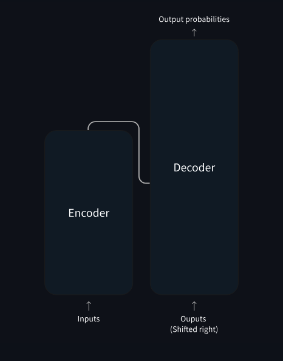

# Learning LLMs (HuggingFace NLP Course) 

<div align="center"><h3>🤗</h3></div>

## Installations 

```bash
pip install transformers
pip install "transformers[torch]"
pip install datasets
pip install evaluate
pip install accelerate
pip install scipy scikit-learn
pip install ipywidgets
pip install gradio

brew install git-lfs
```

> Chapter numbers are according to the [HF Learn](https://huggingface.co/learn) website.

## 1. Transformers



There are a lot of papers that have a key impact of the field. Some of them are in my Mendeley library and will be covered here as well.

But, in general, all Transformer models can be categorised into three families of models:
- **GPT-like**: also called _auto-regressive_ Transf. models
- **BERT-like**: also called _auto-encoding_ Transf. models
- **BART/T5-like**: also called _sequence-to-sequence_ Transf. models

All models are trained in the self-superviased fasion: the objective is computed out of the input.
After that, there is a transfer learning - finetuning the model for a specific task.

### Auto-encoding Models 

The idea: take a text and make vector representation of the text. They trained by corrupting a given sentence, a random word in it, and asking the modfels with finding or reconstructing the initial sentence. The encoder (or auto-encoding) models use only the encoder of a Transformer model.

Usage example: sentence clasification, named entity recognition, extractive question answering (I give you a sentence and ask about the sentence. For example: Passage: "The Eiffel Tower was built in 1889 and is located in Paris, France." Question: "When was the Eiffel Tower built?")

Model Examples: ALBERT, BERT, DIstilBERT, ELECTRA, RoBERTa

### Auto-regressive Models

The idea: take the first words of the text (right shifted) and produce the next word (give a vector of probabilities for the next word). The pretraining here is to predict the next word in a sentence given previous words in the sentence. The decoder (or auto-regressive) models use only the decoder of a Transformer model.

Usage examples: text generation

Model Examples: CTRL, GPT, GPT-2, Transformer XL


### Sequence-to-Sequence Models


The idea: the encoder sees all the sentence, while decoder sees only the first part of the sentence. The pretraining is, for example, by replacing random spans of text (that can contain several words) with a single mask special word, and the objective is to predict those words. The encoder-decoder (or sequence-to-sequence) models use both parts of a Transformer model.

Usage examples: summarization, translation, generative question answering

Model Examples: BART, mBART, Marian, T5, mT5, Pegasus, ProphetNet, M2M100, MarianMT

Or it can be a combination of encoder + decoder models: BERT + GPT-2, BERT + BERT, RoBERTa + RoBERTa, etc.

In all of these models there will be always the intrinsic bias that will not dissappear.

### Example

Pipeline function:

```python
from transformers import pipeline

translator = pipeline("translation", model="Helsinki-NLP/opus-mt-fr-en")
translator("Ce cours est produit par Hugging Face.")
```


## 2. 🤗 Transformers

The pipeline function groups together 3 steps: preprocessing, passing the inputs through the model, and postprocessing:


### Preprocessing with a tokenizer

Here,we use a tokenizer that: (1) splits the input to subwords / subsymbols, aka tokens; (2) maps each token to an integer; (3) adds additionla special tokens to the input.

An example: 

```python
from transformers import AutoTokenizer

checkpoint = "distilbert-base-uncased-finetuned-sst-2-english"
tokenizer = AutoTokenizer.from_pretrained(checkpoint)

raw_inputs = [
    "I've been waiting for a HuggingFace course my whole life.",
    "I hate this so much!",
]
inputs = tokenizer(raw_inputs, padding=True, truncation=True, return_tensors="pt")
print(inputs)
```


### Going through the model

To download the model:

```python
from transformers import AutoModel

checkpoint = "distilbert-base-uncased-finetuned-sst-2-english"
model = AutoModel.from_pretrained(checkpoint)
```

Model heads take the high-dimentional output and project it to a different dimention:


In general you want to use something more specific to the task instead of `AutoModel`. Examples are: 
- Model (retrieve the hidden states)
- ForCausalLM
- ForMaskedLM
- ForMultipleChoice
- ForQuestionAnswering
- ForSequenceClassification
- ForTokenClassification
- and others 🤗

Example: 

```python
from transformers import AutoModelForSequenceClassification

checkpoint = "distilbert-base-uncased-finetuned-sst-2-english"
model = AutoModelForSequenceClassification.from_pretrained(checkpoint)
outputs = model(**inputs)
```


### Postprocessing the output

To continue the example: 

```python
import torch

predictions = torch.nn.functional.softmax(outputs.logits, dim=-1)
print(predictions)
```

Interpritation of the predictions:

```python
model.config.id2label
```

### Models

To create a model with random weights just import the model and its configuration:

```python
from transformers import BertConfig, BertModel

config = BertConfig()
model = BertModel(config)

# Model is randomly initialized!
```

But it is better not to invent the bicycle and th reload the pretrained model: 

```python
from transformers import BertModel

model = BertModel.from_pretrained("bert-base-cased")
```


### Saving methods

```python
model.save_pretrained("my_folder")
```

```python
tokenizer = BertTokenizer.from_pretrained('bert-base-cased')
model = BertModel.from_pretrained("[...]/Learning_LLMs/my_folder")
```

For a deeper dive into the HF Tokenizers library go to: [The 🤗 Tokenizers library](https://huggingface.co/learn/nlp-course/chapter6/1?fw=pt)


### Tokenizers

The goal of tokenizers is to transform text to numbers understandable by the model. We want the best representation that makes most sense to the model and if possible the smallest one.

Word-based tokenizers are very tricky. They build up to huge vocabulary sizes, struggle with plurals of the same word, struggle with unknown words.

Character-based tokenizers built up to very small dictionaries, but it is less meaningful to the models, the input and output will be huge for the model limiting its abilities.

Subword tokenization. THere are two important principles here: frequent words should not be splitted; rare words should be splitted into meaningful subwords. Turkish language especially enjoys this kind of tokenization.

Examples of tokenizers:
- Byte-level BPE for GPT-2
- WordPiece for BERT
- SentencePiece / Unigram for multilingual models

Example:
```python
from transformers import AutoTokenizer

tokenizer = AutoTokenizer.from_pretrained("bert-base-cased")
tokenizer("Using a Transformer network is simple")
```

To save:
```python
tokenizer.save_pretrained("directory_on_my_computer")
```

Tokenization pipeline is executed in two steps. The tokenization itself:
```python
from transformers import AutoTokenizer

tokenizer = AutoTokenizer.from_pretrained("bert-base-cased")

sequence = "Using a Transformer network is simple"
tokens = tokenizer.tokenize(sequence)

print(tokens)
```

The second stage is the conversion to input IDs:
```python
ids = tokenizer.convert_tokens_to_ids(tokens)

print(ids)
```

The reverse is to decode the output for example:
```python
decoded_string = tokenizer.decode([7993, 170, 11303, 1200, 2443, 1110, 3014])
print(decoded_string)
```

By default, the model in HF expects an input of a batch, i.e. the input that contains multiple sequences.
```python
input_ids = torch.tensor([ids])
```

To know what token is used as a padding token check via: `tokenizer.pad_token_id`.

You need to use the _attention mask_ to properly concat sentences. Otherwise, the results will be different for the same sentence if we plug it separately as opposed to plugging it as a part of a batch.

There is always a limit of how long the input sequence can be. The examples for models that can handle huge lengths are: **Longformer** and **LED**. In all other models, trancate the input. Look at the `tokenizer.max_len_single_sentence` property.


```python
# Will pad the sequences up to the maximum sequence length
model_inputs = tokenizer(sequences, padding="longest")

# Will pad the sequences up to the model max length
# (512 for BERT or DistilBERT)
model_inputs = tokenizer(sequences, padding="max_length")

# Will pad the sequences up to the specified max length
model_inputs = tokenizer(sequences, padding="max_length", max_length=8)
```

We can set different tensor types:
```python
sequences = ["I've been waiting for a HuggingFace course my whole life.", "So have I!"]

# Returns PyTorch tensors
model_inputs = tokenizer(sequences, padding=True, return_tensors="pt")

# Returns TensorFlow tensors
model_inputs = tokenizer(sequences, padding=True, return_tensors="tf")

# Returns NumPy arrays
model_inputs = tokenizer(sequences, padding=True, return_tensors="np")
```

Summary of tokenization:
```python
import torch
from transformers import AutoTokenizer, AutoModelForSequenceClassification

checkpoint = "distilbert-base-uncased-finetuned-sst-2-english"
tokenizer = AutoTokenizer.from_pretrained(checkpoint)
model = AutoModelForSequenceClassification.from_pretrained(checkpoint)
sequences = ["I've been waiting for a HuggingFace course my whole life.", "So have I!"]

tokens = tokenizer(sequences, padding=True, truncation=True, return_tensors="pt")
output = model(**tokens)
```

Different types of tokenizers:
- [Byte-Pair Encoding tokenization](https://youtu.be/HEikzVL-lZU)
- [WordPiece tokenization](https://youtu.be/qpv6ms_t_1A)
- [Unigram tokenization](https://youtu.be/TGZfZVuF9Yc)


## 3. Fine-Tuning a Pretrained Model

### Processing the Data

Training a single batch:
```python
import torch
from torch.optim import AdamW
from transformers import AutoTokenizer, AutoModelForSequenceClassification

# Same as before
checkpoint = "bert-base-uncased"
tokenizer = AutoTokenizer.from_pretrained(checkpoint)
model = AutoModelForSequenceClassification.from_pretrained(checkpoint)
sequences = [
    "I've been waiting for a HuggingFace course my whole life.",
    "This course is amazing!",
]
batch = tokenizer(sequences, padding=True, truncation=True, return_tensors="pt")

# This is new
batch["labels"] = torch.tensor([1, 1])

optimizer = AdamW(model.parameters())
loss = model(**batch).loss
loss.backward()
optimizer.step()
```

To load a dataset just use the `load_dataset` function:
```python
from datasets import load_dataset

raw_datasets = load_dataset("glue", "mrpc")
```

To see what feature types are in the dataset use: `raw_train_dataset.features`.
Many of models use pair of sentences to learn, so the tokenizers of HF already know how to deal with pairs:
```python
inputs = tokenizer("This is the first sentence.", "This is the second one.")
inputs
```

But if we want to tokenize the whole dataset, another trick is used. First we buid a separate function that takes as input a single line of a dataset:
```python
def tokenize_function(example):
    return tokenizer(example["sentence1"], example["sentence2"], truncation=True)
```
And then we map with the function through the dataset:
```python
tokenized_datasets = raw_datasets.map(tokenize_function, batched=True)
tokenized_datasets
```
`batched=True` here just speeds up the process internally for the computer.

No padding here, because we want to pad per batch, not per whole dataset. We use the `DataCollatorWithPadding` for this:
```python
from transformers import DataCollatorWithPadding

data_collator = DataCollatorWithPadding(tokenizer=tokenizer)
batch = data_collator(samples)
{k: v.shape for k, v in batch.items()}
```

For a deeper dive into the HF Datasets library go to: [The 🤗 Datasets library](https://huggingface.co/learn/nlp-course/chapter5/1?fw=pt)

### Fine-tuning with Trainer API

Example: 
```python
import torch
import numpy as np
from transformers import AutoModelForSequenceClassification
from transformers import AutoTokenizer, DataCollatorWithPadding
from transformers import Trainer, TrainingArguments
from datasets import load_dataset
import evaluate

# Set device to MPS (Apple GPU) if available
device = torch.device("mps") if torch.backends.mps.is_available() else torch.device("cpu")
# Define training arguments
training_args = TrainingArguments("test-trainer")
# Load dataset
raw_datasets = load_dataset("glue", "mrpc")
# Load tokenizer
checkpoint = "bert-base-uncased"
tokenizer = AutoTokenizer.from_pretrained(checkpoint)

# Tokenization function
def tokenize_function(example):
    return tokenizer(example["sentence1"], example["sentence2"], truncation=True)

# Tokenize dataset
tokenized_datasets = raw_datasets.map(tokenize_function, batched=True)
# Convert datasets to PyTorch format
tokenized_datasets.set_format("torch")
# Data collator
data_collator = DataCollatorWithPadding(tokenizer=tokenizer)
# Load model
model = AutoModelForSequenceClassification.from_pretrained(checkpoint, num_labels=2)
model.to(device)  # Move model to MPS

# definethe metric and the compute_metrics function
metric = evaluate.load("glue", "mrpc")

def compute_metrics(eval_preds):
    metric = evaluate.load("glue", "mrpc")
    logits, labels = eval_preds
    predictions = np.argmax(logits, axis=-1)
    return metric.compute(predictions=predictions, references=labels)

# Initialize Trainer
trainer = Trainer(
    model,
    training_args,
    train_dataset=tokenized_datasets["train"],
    eval_dataset=tokenized_datasets["validation"],
    data_collator=data_collator,
    tokenizer=tokenizer,
    compute_metrics=compute_metrics,
)
# Train the model
trainer.train()
```


### A Full Training

Here, the point is to be able to train our model without using the Trainer API.

The full code example is in [example_manual_training.py](example_manual_training.py).

Prepare the data:
```python
from datasets import load_dataset
from transformers import AutoTokenizer, DataCollatorWithPadding

raw_datasets = load_dataset("glue", "mrpc")
checkpoint = "bert-base-uncased"
tokenizer = AutoTokenizer.from_pretrained(checkpoint)

def tokenize_function(example):
    return tokenizer(example["sentence1"], example["sentence2"], truncation=True)

tokenized_datasets = raw_datasets.map(tokenize_function, batched=True)
data_collator = DataCollatorWithPadding(tokenizer=tokenizer)

tokenized_datasets = tokenized_datasets.remove_columns(["sentence1", "sentence2", "idx"])
tokenized_datasets = tokenized_datasets.rename_column("label", "labels")
tokenized_datasets.set_format("torch")

# tokenized_datasets["train"].column_names -> ["attention_mask", "input_ids", "labels", "token_type_ids"]
```
- remove unnecessary columns
- rename label to labels
- reset to PyTorch

Define dataloaders:
```python
from torch.utils.data import DataLoader

train_dataloader = DataLoader(
    tokenized_datasets["train"], shuffle=True, batch_size=8, collate_fn=data_collator
)
eval_dataloader = DataLoader(
    tokenized_datasets["validation"], batch_size=8, collate_fn=data_collator
)
```
Check the dataloader:
```python
for batch in train_dataloader:
    break
{k: v.shape for k, v in batch.items()}
```
Init the model:
```python
from transformers import AutoModelForSequenceClassification

model = AutoModelForSequenceClassification.from_pretrained(checkpoint, num_labels=2)
```
First, check the model:
```python
outputs = model(**batch)
print(outputs.loss, outputs.logits.shape)
```
All HF Transformers models will return _loss_ is `labels` are provided.

Set the optimizer:
```python
from torch.optim import AdamW
optimizer = AdamW(model.parameters(), lr=5e-5)
```
Lastly, let's define the learning rate scheduler:
```python
from transformers import get_scheduler

num_epochs = 3
num_training_steps = num_epochs * len(train_dataloader)
lr_scheduler = get_scheduler(
    "linear",
    optimizer=optimizer,
    num_warmup_steps=0,
    num_training_steps=num_training_steps,
)
print(num_training_steps)
```
Ok, now for sure the last thing: the device. If we have some GPUs we really want to use them:
```python
import torch

device = torch.device("cuda") if torch.cuda.is_available() else torch.device("cpu")
model.to(device)
```
Finally, let's train:
```python
from tqdm.auto import tqdm

progress_bar = tqdm(range(num_training_steps))

model.train()
for epoch in range(num_epochs):
    for batch in train_dataloader:
        batch = {k: v.to(device) for k, v in batch.items()}
        outputs = model(**batch)
        loss = outputs.loss
        loss.backward()

        optimizer.step()
        lr_scheduler.step()
        optimizer.zero_grad()
        progress_bar.update(1)
```

Now, evaluation...
```python
import evaluate

metric = evaluate.load("glue", "mrpc")
model.eval()
for batch in eval_dataloader:
    batch = {k: v.to(device) for k, v in batch.items()}
    with torch.no_grad():
        outputs = model(**batch)

    logits = outputs.logits
    predictions = torch.argmax(logits, dim=-1)
    metric.add_batch(predictions=predictions, references=batch["labels"])

metric.compute()
```

For accelerated learning use the TF `accelerate` library. It can distribute the learning between multiple GPUs / TPUs. The code sample:
```python
from accelerate import Accelerator
from transformers import AdamW, AutoModelForSequenceClassification, get_scheduler

accelerator = Accelerator()

model = AutoModelForSequenceClassification.from_pretrained(checkpoint, num_labels=2)
optimizer = AdamW(model.parameters(), lr=3e-5)

train_dl, eval_dl, model, optimizer = accelerator.prepare(
    train_dataloader, eval_dataloader, model, optimizer
)

num_epochs = 3
num_training_steps = num_epochs * len(train_dl)
lr_scheduler = get_scheduler(
    "linear",
    optimizer=optimizer,
    num_warmup_steps=0,
    num_training_steps=num_training_steps,
)

progress_bar = tqdm(range(num_training_steps))

model.train()
for epoch in range(num_epochs):
    for batch in train_dl:
        outputs = model(**batch)
        loss = outputs.loss
        accelerator.backward(loss)

        optimizer.step()
        lr_scheduler.step()
        optimizer.zero_grad()
        progress_bar.update(1)
```

## 4. Share Models in 🤗 Hub

USing pretrained model is easy:
```python
from transformers import pipeline

camembert_fill_mask = pipeline("fill-mask", model="camembert-base")
results = camembert_fill_mask("Le camembert est <mask> :)")
```
Better to use `Auto*` classes:
```python
from transformers import AutoTokenizer, AutoModelForMaskedLM

tokenizer = AutoTokenizer.from_pretrained("camembert-base")
model = AutoModelForMaskedLM.from_pretrained("camembert-base")
```

There are three ways to create a new model in the HF Hub:
- Using the `push_to_hub` API
- Using the `huggingface_hub` Python library
- Using the web interface

### `push_to_hub` API

To login:
```python
from huggingface_hub import notebook_login
notebook_login()
```
Through arguments / model / tokenizer:
```python
training_args = TrainingArguments(
    "bert-finetuned-mrpc", save_strategy="epoch", push_to_hub=True
)
model.push_to_hub("dummy-model")
tokenizer.push_to_hub("dummy-model")
```

### `huggingface_hub` Python Library

Creating repo:
```python
from huggingface_hub import create_repo
create_repo("dummy-model")
```
To upload files:
```python
upload_file(
    "<path_to_file>/config.json",
    path_in_repo="config.json",
    repo_id="<namespace>/dummy-model",
)
```
To get the `repo` object:
```python
from huggingface_hub import Repository
repo = Repository("<path_to_dummy_folder>", clone_from="<namespace>/dummy-model")
repo.git_pull()
repo.git_add()
repo.git_commit()
repo.git_push()
repo.git_tag()
```
To save things locally:
```python
model.save_pretrained(".")
tokenizer.save_pretrained(".")
```

### Web Interface

Just as in GitHub.

### Model Card
Look at the paper: [Model Cards for Model Reporting](https://arxiv.org/pdf/1810.03993)
Metadata: [full model card specification](https://github.com/huggingface/hub-docs/blame/main/modelcard.md)

## 5. 🤗 Datasets

For a deeper dive into the HF Datasets library go to: [The 🤗 Datasets library](https://huggingface.co/learn/nlp-course/chapter5/1?fw=pt)

## 6. 🤗 Tokenizers

For a deeper dive into the HF Tokenizers library go to: [The 🤗 Tokenizers library](https://huggingface.co/learn/nlp-course/chapter6/1?fw=pt)

## 7. Classical NLP tasks

To finetune for a specific NLP task, examine:
[Classical NLP tasks](https://huggingface.co/learn/nlp-course/chapter7/1?fw=pt)

## 8. How to ask for help

Advises for debugging and using HF forums: 
[How to ask for help](https://huggingface.co/learn/nlp-course/chapter8/1?fw=pt)

## 9. Demos with Gradio

My first LLM Gradio application (7 lines of code):
```python
import gradio as gr
from transformers import pipeline

model = pipeline("text-generation")

def predict(prompt):
    completion = model(prompt)[0]["generated_text"]
    return completion

gr.Interface(fn=predict, inputs="text", outputs="text").launch()
```
The model is super stupid, but... Feels amazing :)

## 11. Fine-tune Large Language Models

TODO

## 12. Build Reasoning Models

TODO


## Credits

Stand on the shoulders of giants.

- [HF | Learn](https://huggingface.co/learn)
- [Let's build GPT: from scratch, in code, spelled out.](https://www.youtube.com/watch?v=kCc8FmEb1nY&t=9s)

